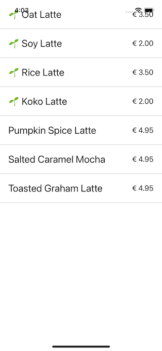
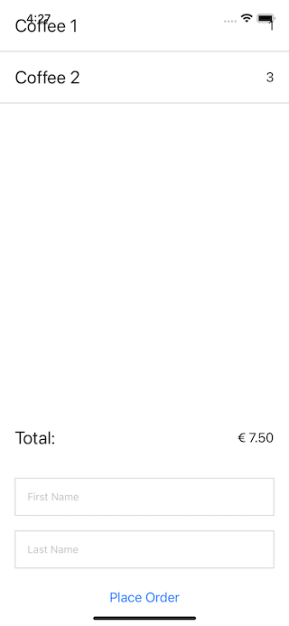
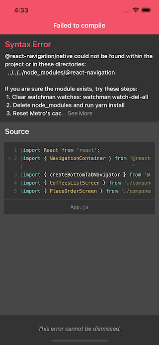
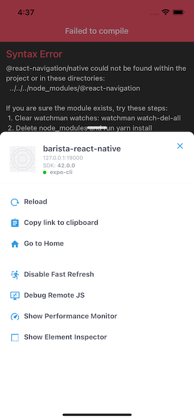
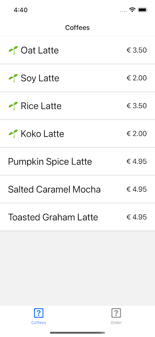
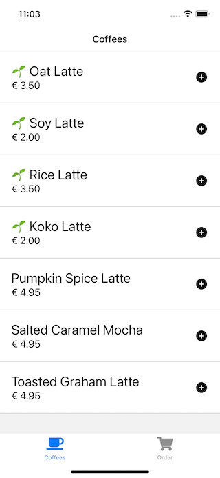
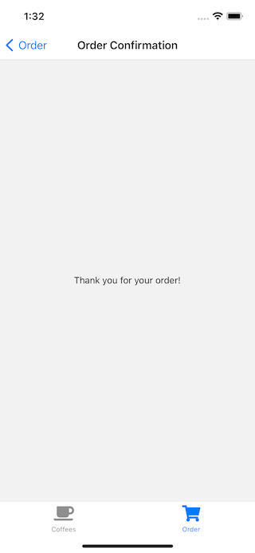

# React Native

React Native allows you to write native applications for Android and iOS using React. Ideally, you can write your code once using JavaScript / React and create platform specific builds.

See also: https://reactnative.dev

## Prerequisites

Make sure to install XCode (through App store) and homebrew on your system. You'll need this when you want to run projects on the iOS Simulator and / or when projects are using CocoaPods for certain native dependencies.

## Expo

We'll build react native apps as managed expo apps instead of bare react native apps. This provides us with an improved developer experience and is sufficient for our applications.

Go through the following guides in the documentation (https://docs.expo.dev):

1. Get Started
2. Tutorial

## React Navigation

After covering the Expo basics, we want to add navigation to our apps. The de-facto library for navigation in react native apps is react navigation: https://reactnavigation.org

Go through the "Fundamentals" on https://reactnavigation.org/docs/getting-started

## Strapi + React Native: Plant Based Barista

We'll create a simple React Native App to enter orders for a fictional coffee bar.

Create a new, managed blank React Native project using expo init:

```
expo init barista-react-native
```

Navigate into that project folder, and run `yarn start`:

```
cd barista-react-native
yarn start
```

The Metro bundler should launch in your browser. Choose to **Run on iOS simulator**.

### Coffees List

Create a folder **components**, and a file **CoffeesListScreen.js** inside of that folder. We'll display the available coffees people can order in this screen. This component will show a list of available coffees, with their prices.

As a start, we'll load a static file (we'll load them from a Strapi backend in a later step). Put the **coffees.json** file (you can find this file in the [projects/barista](projects/barista) folder) in the **assets** folder.

```javascript
import React from 'react';
import { FlatList, StyleSheet, Text, View } from 'react-native';

import coffees from '../assets/coffees.json';

export const CoffeesListScreen = () => {

  const renderItem = ({ item }) => {
    return (
      <View style={styles.item}>
        <Text style={styles.title}>{item.plantbased ? '🌱 ' : ''}{item.name}</Text>
        <Text style={styles.price}>&euro; {item.price.toFixed(2)}</Text>
      </View>
    );
  };

  return (
    <View style={styles.container}>
      <FlatList data={coffees} renderItem={renderItem} keyExtractor={item => `${item.id}`} />
    </View>
  )
};

const styles = StyleSheet.create({
  container: {
    flex: 1
  },
  item: {
    flexDirection: 'row',
    justifyContent: 'space-between',
    alignItems: 'center',
    backgroundColor: '#ffffff',
    padding: 20,
    borderBottomWidth: 1,
    borderBottomColor: '#cccccc'
  },
  title: {
    fontSize: 24,
  },
  price: {
    fontSize: 18,
  },
});
```

Make sure to load this component in your App.js:

```javascript
import React from 'react';
import { CoffeesListScreen } from './components/CoffeesListScreen';

export default function App() {
  return (
    <CoffeesListScreen />
  );
}
```

The result should look something like this:



Ignore the fact that the app ui is showing underneath the  status bar, this will be fixed in a later step.

### Place Order Screen

A second screen we'll have, is a summary of the order. Create a file **components/PlaceOrderScreen.js**, where you'll have the following items:

- A FlatList containing the order items (coffee and amount)
- The total calculated price
- 2 textfields for first and last name
- A "Place Order" Button

As a start, we'll use a hardcoded array of order information.

```javascript
import React, { useState } from 'react';
import { Button, FlatList, StyleSheet, Text, TextInput, View } from 'react-native';

export const PlaceOrderScreen = () => {

  // test data
  const orderItems = [
    {
      coffee: {
        id: 1,
        name: "Coffee 1",
        price: 1.5
      },
      amount: 1
    },
    {
      coffee: {
        id: 2,
        name: "Coffee 2",
        price: 2
      },
      amount: 3
    }
  ];

  const [firstName, setFirstName] = useState('');
  const [lastName, setLastName] = useState('');

  const calculateTotal = () =>
    orderItems.reduce((total, orderItem) => {
      return total + orderItem.coffee.price * orderItem.amount;
    }, 0);

  const placeOrder = async () => {
    console.log("place order");
  };

  const renderItem = ({ item }) => {
    return (
      <View style={styles.item}>
        <Text style={styles.title}>{item.coffee.name}</Text>
        <Text style={styles.amount}>{item.amount}</Text>
      </View>
    );
  };

  return (
    <View style={styles.container}>
      <FlatList data={orderItems} renderItem={renderItem} keyExtractor={item => `${item.coffee.id}`} />

      <View style={styles.totalContainer}>
        <Text style={styles.title}>Total:</Text>
        <Text style={styles.amount}>&euro; {calculateTotal().toFixed(2)}</Text>
      </View>
      <View style={styles.buttonContainer}>
        <TextInput style={styles.textInput} placeholder="First Name" value={firstName} onChangeText={setFirstName} />
        <TextInput style={styles.textInput} placeholder="Last Name" value={lastName} onChangeText={setLastName} />
        <Button title="Place Order" onPress={() => placeOrder()} />
      </View>
    </View>
  )
};

const styles = StyleSheet.create({
  container: {
    flex: 1
  },
  item: {
    flexDirection: 'row',
    justifyContent: 'space-between',
    alignItems: 'center',
    backgroundColor: '#ffffff',
    padding: 20,
    borderBottomWidth: 1,
    borderBottomColor: '#cccccc'
  },
  title: {
    fontSize: 24,
  },
  amount: {
    fontSize: 18,
  },
  totalContainer: {
    flexDirection: 'row',
    justifyContent: 'space-between',
    alignItems: 'center',
    backgroundColor: '#ffffff',
    padding: 20
  },
  buttonContainer: {
    padding: 20
  },
  textInput: {
    backgroundColor: '#ffffff',
    borderColor: "#cccccc",
    borderWidth: 1,
    padding: 16,
    marginBottom: 20
  }
});
```

In **App.js**, swap the CoffeesListScreen component with this new PlaceOrderScreen to test this view. The result should look something like this:



### Tabs

Each of our screens should live on a separate tab. Adjust the App.js, so it has a **NavigationContainer** as a root tag, with a **TabNavigator** and **Screens** inside:

```javascript
import React from 'react';
import { NavigationContainer } from '@react-navigation/native';
import { createBottomTabNavigator } from '@react-navigation/bottom-tabs';
import { CoffeesListScreen } from './components/CoffeesListScreen';
import { PlaceOrderScreen } from './components/PlaceOrderScreen';

const Tab = createBottomTabNavigator();

export default function App() {
  return (
    <NavigationContainer>
      <Tab.Navigator>
        <Tab.Screen name="List" component={CoffeesListScreen} options={{
          title: "Coffees"
        }} />
        <Tab.Screen name="Order" component={PlaceOrderScreen} options={{
        }} />
      </Tab.Navigator>
    </NavigationContainer>
  );
}
```

We're getting an error about unresolved modules:



We're seeing it complaining about `@react-navigation/native`. Add that module to your project, using expo install:

```
expo install @react-navigation/native
```

Trigger the shake command in the simulator, and force a reload:



It's now complaining about `@react-navigation/bottom-tabs`:


Go through the same "expo install" process, to add that module.

We now should have working tabs in our application:



### Tab Icons

You can add an icon to the tab bar, by passing a [tabBarIcon](https://reactnavigation.org/docs/bottom-tab-navigator#tabbaricon) to the screen options.

Expo includes a lot of vector icon libraries. Take a look at https://icons.expo.fyi and choose an icon for the CoffeesList and PlaceOrder screens.

### Keeping track of orders: Context

On our CoffeesList screen, we want to add coffees to our order (which is further handled on the PlaceOrder screen). We'll manage this shared data in a [Context](https://reactjs.org/docs/context.html). Read up on React Context on this page, before continuing.

Add a file **context/GlobalContext.js** to your project, where you'll create and export a context:

```javascript
import { createContext, useState } from 'react';

export const GlobalContext = createContext({
  orderItems: []
});
```

Beware about this default value: this is a fallback object when you want to test components in isolation mode, without using a context provider:

> The defaultValue argument is only used when a component does not have a matching Provider above it in the tree.

So: we won't actually use _this_ instance of the context data, but it's a good idea to set a default value with the object properties you'll use as documentation for your project.

Import this GlobalContext in your App.js, and wrap the NavigationContainer in a GlobalContext.Provider tag:

```javascript
<GlobalContext.Provider value={{
  orderItems: []
}}>
  <NavigationContainer>
    <!-- here be your tabs -->
  </NavigationContainer>
</GlobalContext.Provider>
```

Update the PlaceOrderScreen component, so it uses the orderItems from the GlobalContext instead of the hardcoded array in that component:

```javascript
export const PlaceOrderScreen = () => {

  const context = useContext(GlobalContext);
  const { orderItems } = context;
```

The Order screen should now be empty. Try setting a test order in the GlobalContext Provider tag:

```javascript
<GlobalContext.Provider value={{
  orderItems: [{
    coffee: {
      id: 1,
      name: "Coffee 1",
      price: 1.5
    },
    amount: 1
  },
  {
    coffee: {
      id: 2,
      name: "Coffee 2",
      price: 2
    },
    amount: 3
  }]
}}>
```

The PlaceOrder screen displays the data specified in App.js.

Revert the orderItems array in App.js again to an empty array.

### Adding coffees to the order

Add an `addToOrder` method to the CoffeesListScreen, and update the `renderItem` method, so it contains a button to add coffees to the order:

```javascript
const addToOrder = coffee => {
  console.log(`Add to order: ${coffee.id}`);
};

const renderItem = ({ item }) => {
  return (
    <View style={styles.item}>
      <View>
        <Text style={styles.title}>{item.plantbased ? '🌱 ' : ''}{item.name}</Text>
        <Text style={styles.price}>&euro; {item.price.toFixed(2)}</Text>
      </View>
      <TouchableOpacity onPress={() => {
        addToOrder(item);
      }}>
        <Ionicons name="add-circle" size={24} color="black" />
      </TouchableOpacity>
    </View>
  );
};
```

The CoffeesList screen should now look something like this:



Use the GlobalContext in your CoffeesList screen, and add the code to push or update order items:

```javascript
const context = useContext(GlobalContext);
const { orderItems } = context;

const addToOrder = coffee => {
  console.log(`Add to order: ${coffee.id}`);
  const indexInOrderArray = orderItems.findIndex((check) => check.coffee.id === coffee.id);
  const isAlreadyInArray = (indexInOrderArray > -1);
  if (isAlreadyInArray) {
    orderItems[indexInOrderArray].amount++;
  } else {
    const newOrder = {
      amount: 1,
      coffee: coffee,
    };
    orderItems.push(newOrder);
  }
};
```

Test the app. There are no errors, but the PlaceOrder screen doesn't update when we add / update orders...

We will need to use a State managed variable in order to automatically update the screen. Open up **App.js** and use the useState hook to create state variable. Pass the array and the setter function into the GlobalContext:

```javascript
export default function App() {

  const [orderItems, setOrderItems] = useState([]);

  return (
    <GlobalContext.Provider value={{
      orderItems,
      setOrderItems
    }}>
```

In the addToOrder method of our **CoffeesListScreen**, we'll use the setOrderItems. Make sure to use a shallow copy of the array, by calling the concat() method:

```javascript
const context = useContext(GlobalContext);
const { orderItems, setOrderItems } = context;

const addToOrder = coffee => {
  console.log(`Add to order: ${coffee.id}`);
  const copiedArray = orderItems.concat();
  const indexInOrderArray = copiedArray.findIndex((check) => check.coffee.id === coffee.id);
  const isAlreadyInArray = (indexInOrderArray > -1);
  if (isAlreadyInArray) {
    copiedArray[indexInOrderArray].amount++;
  } else {
    const newOrder = {
      amount: 1,
      coffee: coffee,
    };
    copiedArray.push(newOrder);
  }
  setOrderItems(copiedArray);
};
```

The orders added from the CoffeesList should now appear in the PlaceOrder screen.

### Strapi App

We will add a backend to our app, so that coffees and orders are synced with an API.

You'll find a MySQL docker app in this repo - this Docker app contains a single container for running a MySQL server on your system.

Start the Docker app, launch [Sequal Ace](https://apps.apple.com/us/app/sequel-ace/id1518036000?ls=1) and create a database called `barista`.

Currently, Strapi is compatible with node versions up to version 14. Make sure to run a compatible node version prior to creating the strapi application!

Open a Terminal, navigate to the folder where you want to create your application, and execute `yarn create strapi-app barista`.

Choose for "Custom", and use the following answers:

1. Template: no
2. Database: mysql
3. Database settings: name=barista (default), host=127.0.0.1 (default), port=3306 (default), user / pass: cfr docker-compose.yml.
4. Enable SSL: no

Run `yarn develop` in the generated folder to start Strapi in dev mode.

### Collection Types

Create a "Coffee" collection type, with the following config:


Create an "Order" collection type, with the following config:


Go to **Settings > Roles > Public** and make sure to set the followin permissions, to allow for API access:


### Content

Take a look at [coffees.json](projects/barista/coffees.json) and make sure to add them to your database using Strapi.

### Loading Coffees from our API

Opening http://localhost:1337/coffees should return a JSON response with the coffees from our database. Let's load this instead of the json file in our assets folder.

Remove the `import coffees = ...` from your **CoffeesListScreen** component. Add a state variable to manage the coffees array, and use a useEffect hook to load the coffees from our API:

```javascript
const [coffees, setCoffees] = useState([]);
useEffect(() => {
  const init = async () => {
    const response = await fetch('http://localhost:1337/coffees');
    const json = await response.json();
    setCoffees(json);
  };
  init();
}, []);
```

The list now displays the coffees from our Strapi API. It's not a good idea to hardcode the API urls in your apps. Luckely Expo provides us with a mechanism to get values from a config file. Read through the docs at https://docs.expo.dev/workflow/configuration/

Create an **app.config.js** file in your React Native project root. Export a config object, containing our api url:

```javascript
export default {
  extra: {
    apiURL: 'http://localhost:1337',
  },
};
```

Import the Constants in your CoffeesListScreen (`import Constants from 'expo-constants';`) and use the apiURL setting in your fetch call:

```javascript
const response = await fetch(`${Constants.manifest.extra.apiURL}/coffees`);
```

You might need to do an app reload (Shake Gesture > Reload) to get this to work, the app should now use the external apiURL setting and load the coffees.

### Saving an order with our API

Our Strapi API also handles order. By sending a POST request to `http://localhost:1337/orders` we can save an order.

Update the placeOrder method, so that it posts a valid order object:

```javascript
const placeOrder = async () => {
  const orderData = { name: firstName, last_name: lastName, orderItems };

  const resp = await fetch(`${Constants.manifest.extra.apiURL}/orders`, {
    method: "POST",
    body: JSON.stringify(orderData),
    headers: { "Content-Type": "application/json" },
  });
  if (resp.ok) {
    setOrderItems([]);
  }
};
```

Place an order and check your Strapi backend. The full order should be saved.

### Save Progress

Our basic app functionality works. All we need to do now, is add some UX improvements.

When our order is being placed, we want to show a progress indicator to the user. 

Create a state variable `isOrdering` in the **PlaceOrderScreen**:

```javascript
const [isOrdering, setIsOrdering] = useState(false);
```

Add calls to setIsOrdering in the placeOrder method:

```javascript
const placeOrder = async () => {
  setIsOrdering(true);
  const orderData = { name: firstName, last_name: lastName, orderItems };
  //...
  if (resp.ok) {
    setOrderItems([]);
    setIsOrdering(false);
  }
}
```

And use the state variable to return an alternative view:

```javascript
return (isOrdering ? 
  <View style={{...styles.container, alignItems: 'center', justifyContent: 'center'}}>
    <Text style={styles.title}>Placing Order...</Text>
  </View>
  : 
  <View style={styles.container}>
    <FlatList data={orderItems} renderItem={renderItem} keyExtractor={item => `${item.coffee.id}`} />

    <View style={styles.totalContainer}>
      <Text style={styles.title}>Total:</Text>
      <Text style={styles.amount}>&euro; {calculateTotal().toFixed(2)}</Text>
    </View>
    <View style={styles.buttonContainer}>
      <TextInput style={styles.textInput} placeholder="First Name" value={firstName} onChangeText={setFirstName} />
      <TextInput style={styles.textInput} placeholder="Last Name" value={lastName} onChangeText={setLastName} />
      <Button title="Place Order" onPress={() => placeOrder()} />
    </View>
  </View>
)
```

### Order Confirmation

When an order was successfull, we want to navigate to a separate confirmation screen. In order (...) to do that, we'll need to wrap our PlaceOrder component in a **Stack Navigator**.

First of all, let's create the confirmation screen. We'll just use a basic, centered text for now. Create a file **components/OrderConfirmationScreen.js** with the following contents:

```javascript
import React from 'react';
import { StyleSheet, Text, View } from 'react-native';

export const OrderConfirmationScreen = () => {
  return (
    <View style={styles.containerCentered}>
    <Text>Thank you for your order!</Text>
  </View>
  );
};

const styles = StyleSheet.create({
  containerCentered: {
    flex: 1,
    alignItems: 'center',
    justifyContent: 'center'
  }
});
```

Create a file **components/OrderScreen.js**, which contains a stack of two screens: the **PlaceOrderScreen** and the **OrderConfirmationScreen**:

```javascript
import { createNativeStackNavigator } from '@react-navigation/native-stack';
import React from 'react';
import { OrderConfirmationScreen } from './OrderConfirmationScreen';
import { PlaceOrderScreen } from './PlaceOrderScreen';

const Stack = createNativeStackNavigator();

export const OrderScreen = () => {
  return (
    <Stack.Navigator>
      <Stack.Screen
          name="PlaceOrder"
          component={PlaceOrderScreen}
          options={{
            title: "Order"
          }}
        />
      <Stack.Screen
          name="OrderConfirmation"
          component={OrderConfirmationScreen}
          options={{
            title: "Order Confirmation"
          }}
        />
    </Stack.Navigator>
  );
};
```

Finally, include this new OrderScreen instead of PlaceOrderScreen in your **App.js** file:

```javascript
<Tab.Screen name="Order" component={OrderScreen} options={{
  tabBarIcon: ({ color, size }) => (<FontAwesome5 name="shopping-cart" size={size} color={color} />)
}} />
```

Test the app, and read the error:

> Unable to resolve module @react-navigation/native-stack

We haven't added @react-navigation/native-stack to our project yet, so install it using `expo install`:

```
expo install @react-navigation/native-stack
```

The next error we're getting is:

> Unable to resolve module react-native-screens

Again, fix it with an `expo install` of that module:

```
expo install react-native-screens
```

It should work after installing these modules. However, it might be able that the current build is still not loading in your simulator. If that happens, close the app in the simulator, and restart the metro CLI (the currently running yarn start command in your react native project root).

Check the Order tab; you'll notice we've got a duplicate navigation bar:


That's because we're nesting two navigators: we've got our root TabNavigator, and a nested StackNavigator. Let's hide the navigation bar for our Order Tab, by setting headerShown to false in **App.js**:

```javascript
<Tab.Screen name="Order" component={OrderScreen} options={{
  headerShown: false,
  tabBarIcon: ({ color, size }) => (<FontAwesome5 name="shopping-cart" size={size} color={color} />)
}} />
```

Let's add the necessary logic to **PlaceOrderScreen** to navigate to the order confirmation screen. First of all, destructure the navigation property:

```javascript
export const PlaceOrderScreen = ({ navigation }) => {
```

Use that navigation instance, to navigate to our confirmation screen. As we've given it the name `OrderConfirmation` in our OrderScreen component, we can use that name in the navigate call:

```javascript
if (resp.ok) {
  navigation.navigate('OrderConfirmation');
  setOrderItems([]);
  setIsOrdering(false);
}
```

Test the app. It now animates to a separate screen after placing the order:

