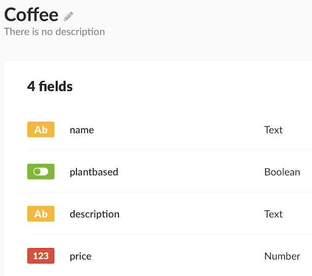

# React Native

React Native allows you to write native applications for Android and iOS using React. Ideally, you can write your code once using JavaScript / React and create platform specific builds.

See also: https://reactnative.dev

## Prerequisites

Make sure to install XCode (through App store) and homebrew on your system. You'll need this when you want to run projects on the iOS Simulator and / or when projects are using CocoaPods for certain native dependencies.

## Expo

We'll build react native apps as managed expo apps instead of bare react native apps. This provides us with an improved developer experience and is sufficient for our applications.

Go through the following guides in the documentation (https://docs.expo.dev):

1. Get Started
2. Tutorial

## React Navigation

After covering the Expo basics, we want to add navigation to our apps. The de-facto library for navigation in react native apps is react navigation: https://reactnavigation.org

Go through the "Fundamentals" on https://reactnavigation.org/docs/getting-started

## Strapi App - Plant Based Barista

You'll find a MySQL docker app in this repo - this Docker app contains a single container for running a MySQL server on your system.

Start the Docker app, launch [Sequal Ace](https://apps.apple.com/us/app/sequel-ace/id1518036000?ls=1) and create a database called `barista`.

Currently, Strapi is compatible with node versions up to version 14. Make sure to run a compatible node version prior to creating the strapi application!

Open a Terminal, navigate to the folder where you want to create your application, and execute `yarn create strapi-app barista`.

Choose for "Custom", and use the following answers:

1. Template: no
2. Database: mysql
3. Database settings: name=barista (default), host=127.0.0.1 (default), port=3306 (default), user / pass: cfr docker-compose.yml.
4. Enable SSL: no

Run `yarn develop` in the generated folder to start Strapi in dev mode.

### Collection Types

Create a "Coffee" collection type, with the following config:



Create an "Order" collection type, with the following config:


Go to **Settings > Roles > Public** and make sure to set the followin permissions, to allow for API access:


### Content

Take a look at [coffees.json](projects/barista/coffees.json) and make sure to add them to your database using Strapi.

### React Native App

Create a new, managed blank React Native project.

Add react navigation & bottom tabs support using expo install:

```
expo install react-native-screens react-native-safe-area-context @react-navigation/native @react-navigation/bottom-tabs
```